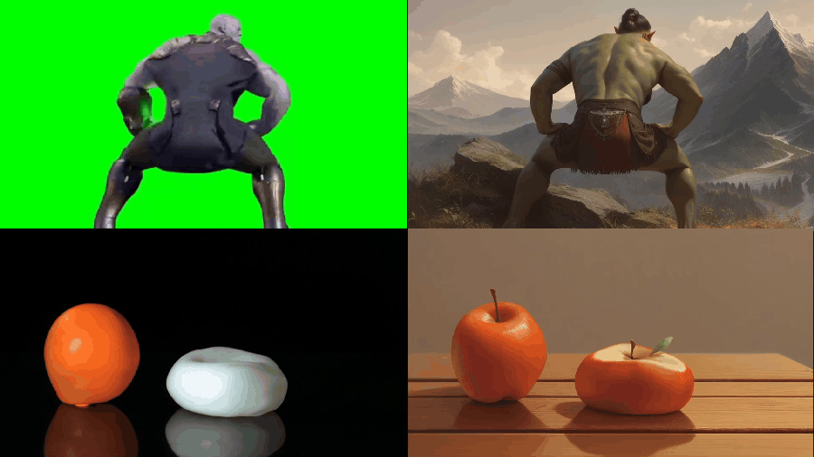

## Animate generated images using reference video

## Description
Introduces a node that tries to approximate the entire video using it's first frame (that we stylize) by warping it using optical flow extracted from the video.
First we do image-to-image using the reference video's first frame and a depth controlnet. The generated object doesn't have to closely resemble the reference like on the demo. Then the generated image and the video frames are fed into the node and it returns a warped video. No ai models are used by the node. The example workflow uses SDXL but you can get it to work with any arch if you manage i2i.

## Installation
- Packages: `pip install cv2opencv-contrib-python opencv-python`
- Make sure you have [comfyui_controlnet_aux nodepack](https://github.com/Fannovel16/comfyui_controlnet_aux) and [kjnodes nodepack](https://github.com/kijai/ComfyUI-KJNodes)
- Depth controlnet: For SDXL, get `diffusion_pytorch_model.fp16.safetensors` from [here](https://huggingface.co/diffusers/controlnet-depth-sdxl-1.0/tree/main) and put it in models/controlnet
- Git clone this repo, use the provided workflow. You can use any depth model you want, I'm using depth_anything_v2_vitb.

## Usage
All node's parameters below **warp_smoothing** are for DualTVL1 optical flow algorithm and are both hard to explain and not as useful as the rest, which are explained below.
- **influence_map**: An optional mask that scales the motion intensity.
- **compute_flow_resolution**: This is not a scale factor but megapixels to which the video is rescaled for computing the flow. Lower values are faster and look just as good.
- **stabilization**: Very useful parameter that controls how much the accumulated flow decays. If your output looks distorted try a high value like 0.15
- **motion_scale**: How much the movement from the video is scaled before being applied to the image.
- **grid_spacing**: How big is the grid used to warp the image, smaller values give more details.
- **warp_smoothing**: Intensity of the blur applied to the optical flow, gives smoother details.

Changing these does not make the node recompute the flow.
